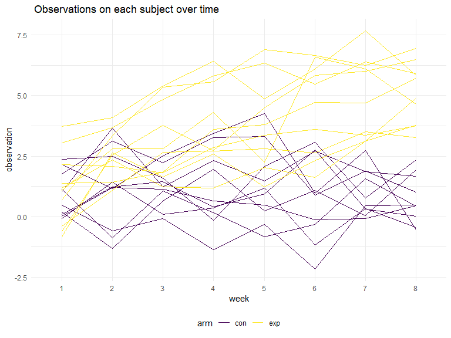
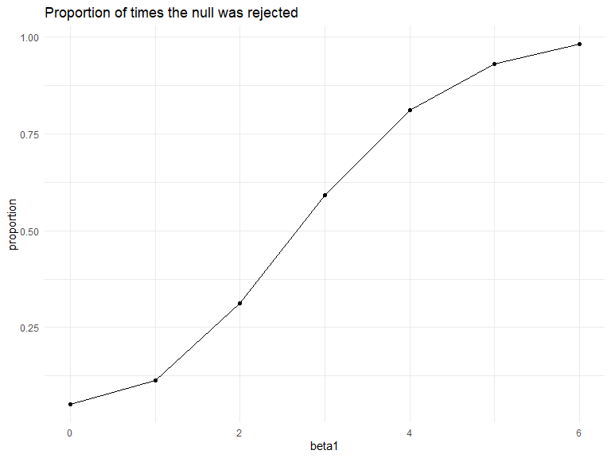
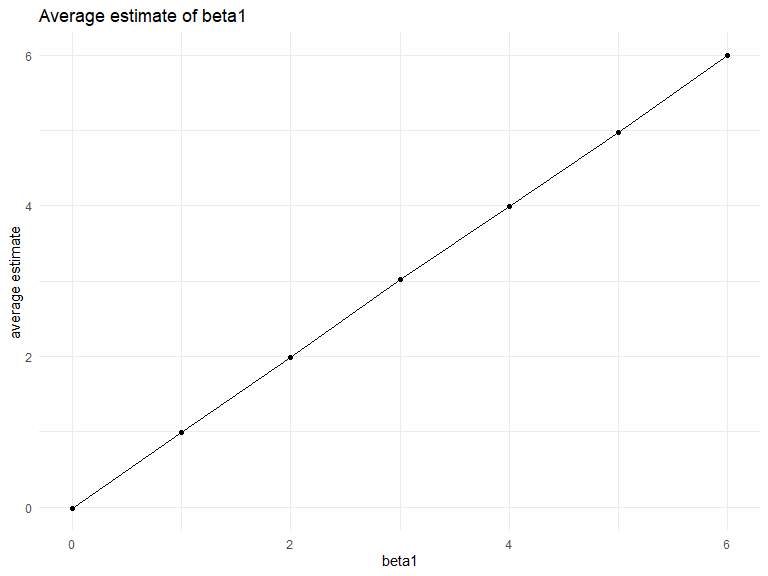
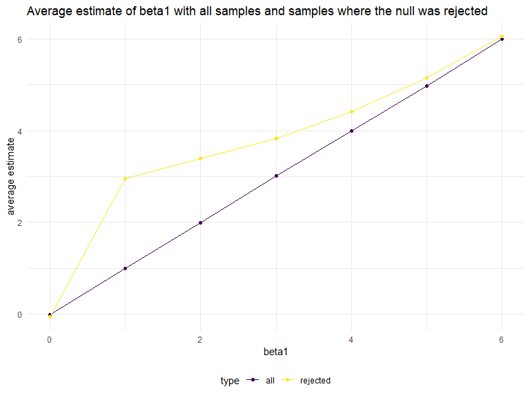

p8105\_hw5\_yq2279
================
Qi Yuchen
2019/11/3

# Problem 1

``` r
set.seed(10)

iris_with_missing = iris %>% 
  map_df(~replace(.x, sample(1:150, 20), NA)) %>%
  mutate(Species = as.character(Species))
```

### The function for replacing missing values

``` r
fill_na = function(x){
  if (is.numeric(x)) {
    x = replace_na(x, mean(x, na.rm = TRUE))
  }
  else if (is.character(x)) {
    x = replace_na(x, "virginica")
  }
  else {
  stop("Not a valid input")
  }
  
  x
}
```

### Apply the function to the columns of iris\_with\_missing

``` r
iris_na_filled = map_df(iris_with_missing, fill_na)

knitr::kable(iris_na_filled[1:10,])
```

| Sepal.Length | Sepal.Width | Petal.Length | Petal.Width | Species |
| -----------: | ----------: | -----------: | ----------: | :------ |
|     5.100000 |         3.5 |     1.400000 |    0.200000 | setosa  |
|     4.900000 |         3.0 |     1.400000 |    0.200000 | setosa  |
|     4.700000 |         3.2 |     1.300000 |    0.200000 | setosa  |
|     4.600000 |         3.1 |     1.500000 |    1.192308 | setosa  |
|     5.000000 |         3.6 |     1.400000 |    0.200000 | setosa  |
|     5.400000 |         3.9 |     1.700000 |    0.400000 | setosa  |
|     5.819231 |         3.4 |     1.400000 |    0.300000 | setosa  |
|     5.000000 |         3.4 |     1.500000 |    0.200000 | setosa  |
|     4.400000 |         2.9 |     1.400000 |    0.200000 | setosa  |
|     4.900000 |         3.1 |     3.765385 |    0.100000 | setosa  |

# Problem 2

### A dataframe containing all file names

``` r
df_file_name = tibble(
  file_name = list.files("data", full.names = TRUE)
)
```

### Read in data

``` r
df_read_data = df_file_name %>% 
  mutate(data = map(file_name, read_csv))
```

### Tidy the result

``` r
df = df_read_data %>%
  unnest(data) %>% 
  mutate(
    file_name = str_replace(file_name, "data/", ""),
    file_name = str_replace(file_name, "\\.csv", "")
    ) %>% 
  mutate(subject = file_name) %>% 
  separate(file_name, into = c("arm", "ID"), sep = "_") %>% 
  mutate(arm = as.factor(arm)) %>% 
  select(-ID) %>% 
  pivot_longer(week_1:week_8, names_to = "week", names_prefix = "week_" ,values_to = "observation") 
```

### Make a spaghetti plot

``` r
df %>% 
  ggplot(aes(x = week, y = observation, group = subject, color = arm)) +
  geom_line() +
  labs(
    title = " Observations on each subject over time"
  )
```



There is an increasing trend in the experimental group while in the
control group observations there is no obvious trend. The observations
from the experimental group are larger than those from the control group
after week 6.

# Problem 3

### beta1 = 0

``` r
# define the function for simulation
sim_regression = function(n = 30, beta0 = 2, beta1, sd = sqrt(50)) {
  
  sim_data = tibble(
    x = rnorm(n),
    y = beta0 + beta1 * x + rnorm(n, 0, sd)
  )
  
  ls_fit = lm(y ~ x, data = sim_data)
  
  broom::tidy(ls_fit) %>% 
    filter(term == "x") %>% 
    janitor::clean_names() %>% 
    select(beta1_hat = estimate, p_value)
}

# generate 10000 datasets
sim_results = 
  rerun(10000, sim_regression(beta1 = 0)) %>% 
  bind_rows()

knitr::kable(sim_results[1:10,])
```

|  beta1\_hat |  p\_value |
| ----------: | --------: |
|   2.0201501 | 0.2066396 |
|   1.2305232 | 0.1819841 |
|   0.6031086 | 0.6059809 |
|   3.0332161 | 0.0001487 |
| \-1.1914352 | 0.4713686 |
| \-1.4932800 | 0.2194478 |
| \-1.9724616 | 0.1924220 |
|   0.3308369 | 0.7694134 |
|   0.5762718 | 0.6703726 |
|   2.4019539 | 0.1336447 |

### beta1 = 0:6

``` r
sim_results = 
  tibble(beta1 = c(0:6)) %>% 
  mutate(
    output_lists = map(.x = beta1, ~rerun(10000, sim_regression(beta1 = .x))),
    est_p_dfs = map(output_lists, bind_rows)) %>% 
  select(-output_lists) %>% 
  unnest(est_p_dfs)

knitr::kable(sim_results[1:10,])
```

| beta1 |  beta1\_hat |  p\_value |
| ----: | ----------: | --------: |
|     0 | \-0.9123087 | 0.4908413 |
|     0 |   2.1065043 | 0.0664960 |
|     0 |   0.8133997 | 0.4732169 |
|     0 |   2.0252486 | 0.1131991 |
|     0 |   1.0605277 | 0.3073156 |
|     0 | \-1.4779573 | 0.1964579 |
|     0 |   0.6696424 | 0.5727645 |
|     0 | \-1.2441302 | 0.4514328 |
|     0 |   0.2231892 | 0.8763299 |
|     0 |   0.2212818 | 0.8562044 |

### Make a plot showing the proportion of times the null was rejected

``` r
# a function to decide rejecting the null or not
h_test = function(p){
  if (p < 0.05) {
    return(1) # 1 means rejecting the null
  } else {
    return(0) # 0 means not rejecting
  }
}

sim_results %>% 
  mutate(reject = map_dbl(p_value, h_test)) %>% 
  group_by(beta1) %>% 
  summarise(proportion_reject = mean(reject)) %>% 
  ggplot(aes(x = beta1, y = proportion_reject)) +
  geom_point() + geom_line() +
  labs(
    title = "Proportion of times the null was rejected",
    y = "proportion"
  )
```



Power increases and tends to 1 as effect size increases.

### Make a plot showing the average estimate of beta1

``` r
sim_results %>% 
  group_by(beta1) %>% 
  summarise(ave_est = mean(beta1_hat)) %>% 
  ggplot(aes(x = beta1, y = ave_est)) +
  geom_point() + geom_line() +
  labs(
    title = "Average estimate of beta1",
    y = "average estimate"
  )
```



### Only in samples for which the null was rejected

``` r
df_plot1 = sim_results %>% 
  group_by(beta1) %>% 
  summarise(ave_est = mean(beta1_hat)) %>% 
  mutate(type = "all")

df_plot2 = sim_results %>% 
  mutate(reject = map_dbl(p_value, h_test)) %>%
  filter(reject == 1) %>% 
  group_by(beta1) %>% 
  summarise(ave_est = mean(beta1_hat)) %>% 
  mutate(type = "rejected")

df_plot = bind_rows(df_plot1, df_plot2)
  
df_plot %>% 
  ggplot(aes(x = beta1, y = ave_est, color = type)) +
  geom_point() + geom_line() +
  labs(
    title = "Average estimate of beta1 with all samples and samples where the null was rejected",
    y = "average estimate"
  ) 
```



Generally, the sample average of beta1 across tests for which the null
is rejected isn’t approximately equal to the true value of bata1. For
beta1 = 1:6, the average estimate is larger than the true value and gets
closer to the true value as beta1 increases.  
When the null beta1 = 0 is rejected, the beta1 estimate we get is
significantly different from 0, so after excluding the estimate values
that are more close to zero, the average estimate will be larger for
beta1 = 1:6. As beta1 increases, it gets away from the null and power
increases, so the average estimate from rejected cases becomes closer to
the true beta1.
